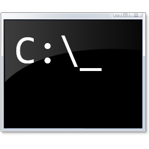

# Hi!, and You're Welcome

<h2 align="center">My tech stack</h2>

  
  
  
  
  

  
  
  
  
  

  
  
  
  
  

  
  
  

  
  

----

📧 [Contact me](https://gist.github.com/sunvis0r/fb2d9347516afadda9ef242e9b6d1516)
